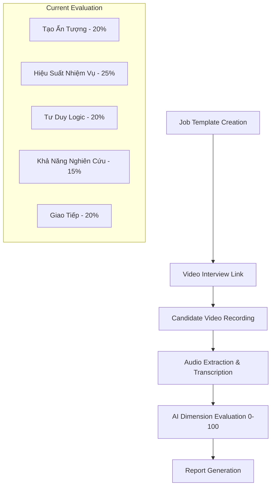
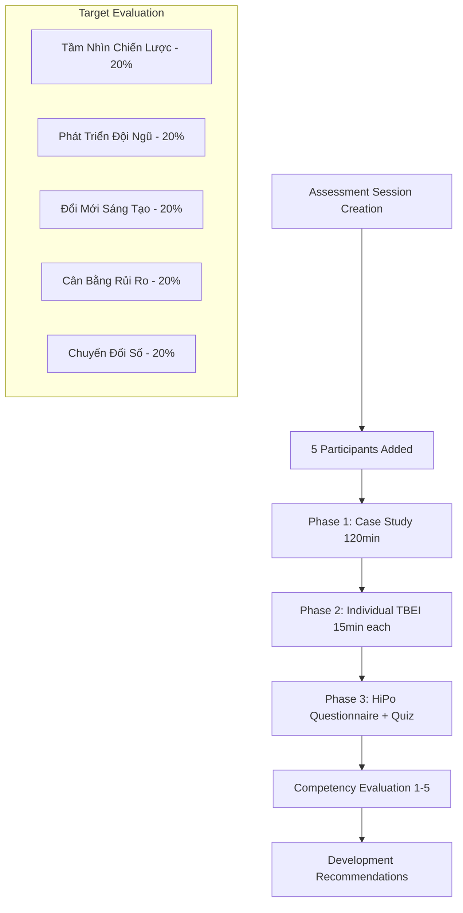

# VietinBank Assessment Center - Implementation Gaps & Modifications

**Document Version**: 1.0
**Date**: 2025-11-25
**Status**: Analysis Complete - Implementation Required

---

## Executive Summary

The current VietinBank AI Interviewer system implements a **video-based interview platform** with 5-dimension evaluation (0-100 scale). The Assessment Center specification defines a completely different system with **3-phase competency assessment** using case studies, behavioral interviews, and quizzes with 5 competencies (1-5 scale).

**Key Gap**: The Assessment Center features exist only as YAML configuration - no database schema, UI components, or evaluation logic has been implemented.

---

## 1. CURRENT vs TARGET ARCHITECTURE

### 1.1 Current System (Implemented & Working)



### 1.2 Target System (Specified but Not Implemented)



---

## 2. DATABASE SCHEMA CHANGES REQUIRED

### 2.1 NEW TABLES NEEDED

The current schema only supports individual video interviews. Assessment Center requires group sessions with multiple participants and assessment types.

#### AssessmentSession
```sql
CREATE TABLE assessment_sessions (
    id TEXT PRIMARY KEY,
    name TEXT NOT NULL,
    organization_id TEXT NOT NULL,
    job_template_id TEXT,
    status TEXT CHECK (status IN ('created', 'case_study_in_progress', 'case_study_completed', 'tbei_in_progress', 'completed')),
    created_at TIMESTAMP DEFAULT CURRENT_TIMESTAMP,
    completed_at TIMESTAMP,
    FOREIGN KEY (organization_id) REFERENCES organizations(id),
    FOREIGN KEY (job_template_id) REFERENCES job_templates(id)
);
```

#### AssessmentParticipant
```sql
CREATE TABLE assessment_participants (
    id TEXT PRIMARY KEY,
    session_id TEXT NOT NULL,
    name TEXT NOT NULL,
    email TEXT NOT NULL,
    role_code TEXT CHECK (role_code IN ('A', 'B', 'C', 'D', 'E')),
    role_name TEXT NOT NULL,
    speaker_label TEXT, -- For Phase 1 transcript mapping
    interview_token TEXT UNIQUE, -- For Phase 2 individual access
    tbei_status TEXT DEFAULT 'pending' CHECK (tbei_status IN ('pending', 'in_progress', 'completed')),
    hipo_status TEXT DEFAULT 'pending' CHECK (hipo_status IN ('pending', 'in_progress', 'completed')),
    quiz_status TEXT DEFAULT 'pending' CHECK (quiz_status IN ('pending', 'in_progress', 'completed')),
    email_sent_at TIMESTAMP,
    created_at TIMESTAMP DEFAULT CURRENT_TIMESTAMP,
    FOREIGN KEY (session_id) REFERENCES assessment_sessions(id)
);
```

#### CaseStudyTranscript
```sql
CREATE TABLE case_study_transcripts (
    id TEXT PRIMARY KEY,
    session_id TEXT NOT NULL,
    sequence_number INTEGER NOT NULL,
    raw_transcript TEXT NOT NULL,
    consolidated_transcript TEXT NOT NULL, -- With participant names mapped
    speaker_mapping TEXT, -- JSON: {"Speaker 1": "participant_id"}
    created_at TIMESTAMP DEFAULT CURRENT_TIMESTAMP,
    duration_seconds INTEGER,
    FOREIGN KEY (session_id) REFERENCES assessment_sessions(id)
);
```

#### CaseStudyEvaluation
```sql
CREATE TABLE case_study_evaluations (
    id TEXT PRIMARY KEY,
    session_id TEXT NOT NULL,
    participant_id TEXT NOT NULL,
    transcript_id TEXT NOT NULL,
    competency_id TEXT NOT NULL, -- strategic_thinking, innovation, etc.
    score INTEGER CHECK (score BETWEEN 1 AND 5),
    level TEXT CHECK (level IN ('needs_improvement', 'meets_requirements', 'exceeds_requirements')),
    rationale TEXT,
    evidence TEXT, -- JSON array of quotes
    evidence_strength TEXT CHECK (evidence_strength IN ('strong', 'moderate', 'weak', 'insufficient')),
    count_toward_overall BOOLEAN DEFAULT TRUE,
    created_at TIMESTAMP DEFAULT CURRENT_TIMESTAMP,
    updated_at TIMESTAMP DEFAULT CURRENT_TIMESTAMP,
    FOREIGN KEY (session_id) REFERENCES assessment_sessions(id),
    FOREIGN KEY (participant_id) REFERENCES assessment_participants(id),
    FOREIGN KEY (transcript_id) REFERENCES case_study_transcripts(id)
);
```

#### TBEIResponse (New Structure)
```sql
CREATE TABLE tbei_responses (
    id TEXT PRIMARY KEY,
    participant_id TEXT NOT NULL,
    competency_id TEXT NOT NULL, -- digital_transformation, talent_development
    question_id TEXT NOT NULL, -- DT_Q1, DT_Q2, TD_Q1, etc.
    selected_question_index INTEGER, -- Which of 3 questions they chose (0, 1, 2)
    transcript TEXT NOT NULL,
    audio_url TEXT,
    duration_seconds INTEGER,
    evaluation TEXT, -- JSON: {score, rationale, evidence, star_analysis, behavioral_indicators}
    created_at TIMESTAMP DEFAULT CURRENT_TIMESTAMP,
    FOREIGN KEY (participant_id) REFERENCES assessment_participants(id)
);
```

#### HiPoAssessment
```sql
CREATE TABLE hipo_assessments (
    id TEXT PRIMARY KEY,
    participant_id TEXT NOT NULL,
    ability_score INTEGER CHECK (ability_score BETWEEN 5 AND 25),
    aspiration_score INTEGER CHECK (aspiration_score BETWEEN 5 AND 25),
    engagement_score INTEGER CHECK (engagement_score BETWEEN 5 AND 25),
    integrated_score INTEGER CHECK (integrated_score BETWEEN 5 AND 25),
    total_score INTEGER CHECK (total_score BETWEEN 20 AND 100),
    responses TEXT, -- JSON: {"Q1": 4, "Q2": 5, ..., "Q20": 3}
    open_response1 TEXT, -- Q21 answer
    open_response2 TEXT, -- Q22 answer
    ability_classification TEXT CHECK (ability_classification IN ('excellent', 'good', 'average', 'needs_attention')),
    aspiration_classification TEXT CHECK (aspiration_classification IN ('excellent', 'good', 'average', 'needs_attention')),
    engagement_classification TEXT CHECK (engagement_classification IN ('excellent', 'good', 'average', 'needs_attention')),
    integrated_classification TEXT CHECK (integrated_classification IN ('excellent', 'good', 'average', 'needs_attention')),
    completed_at TIMESTAMP DEFAULT CURRENT_TIMESTAMP,
    created_at TIMESTAMP DEFAULT CURRENT_TIMESTAMP,
    FOREIGN KEY (participant_id) REFERENCES assessment_participants(id)
);
```

#### QuizResponse
```sql
CREATE TABLE quiz_responses (
    id TEXT PRIMARY KEY,
    participant_id TEXT NOT NULL,
    answers TEXT, -- JSON: {questionId: selectedOption}
    score INTEGER,
    total_questions INTEGER,
    completed_at TIMESTAMP DEFAULT CURRENT_TIMESTAMP,
    time_spent_seconds INTEGER,
    FOREIGN KEY (participant_id) REFERENCES assessment_participants(id)
);
```

### 2.2 EXISTING TABLE MODIFICATIONS

No modifications to existing tables required. The Assessment Center will coexist with the current video interview system.

---

## 3. NEW API ENDPOINTS REQUIRED

### 3.1 Assessment Session Management
```
POST   /api/assessment/sessions                    # Create new assessment session
GET    /api/assessment/sessions                    # List all sessions
GET    /api/assessment/sessions/[id]               # Get session details
PATCH  /api/assessment/sessions/[id]               # Update session
DELETE /api/assessment/sessions/[id]               # Delete session
```

### 3.2 Participant Management
```
POST   /api/assessment/sessions/[id]/participants  # Add participant to session
PATCH  /api/assessment/participants/[id]           # Update participant details
DELETE /api/assessment/participants/[id]           # Remove participant
POST   /api/assessment/sessions/[id]/send-emails   # Email interview links to all participants
```

### 3.3 Case Study (Phase 1)
```
POST   /api/assessment/sessions/[id]/start         # Start case study recording
POST   /api/assessment/sessions/[id]/transcript    # Submit transcript chunk (every 60s)
POST   /api/assessment/sessions/[id]/speaker-map   # Update speaker→participant mapping
GET    /api/assessment/sessions/[id]/evaluations   # Get real-time evaluations
POST   /api/assessment/sessions/[id]/complete-case-study  # Complete Phase 1
```

### 3.4 Individual Interview (Phase 2)
```
GET    /api/interview/[token]                      # Get participant interview (MODIFY EXISTING)
POST   /api/interview/[token]/select-question      # Select TBEI question from 3 options
POST   /api/interview/[token]/submit-response      # Submit TBEI response (MODIFY EXISTING)
POST   /api/interview/[token]/submit-hipo-assessment   # Submit HiPo questionnaire
POST   /api/interview/[token]/submit-quiz          # Submit quiz answers
```

### 3.5 Progress Tracking
```
GET    /api/assessment/sessions/[id]/progress      # Get all participants' progress dashboard
```

---

## 4. NEW UI COMPONENTS REQUIRED

### 4.1 Assessment Session Management

#### CreateAssessmentSession.tsx
- Form to create assessment session
- Add 5 participants with role assignments
- Email validation and role mapping

#### AssessmentSessionDashboard.tsx
- Overview of session progress
- Phase 1 & Phase 2 status tracking
- Participant progress table with real-time updates

### 4.2 Case Study Interface (Phase 1)

#### CaseStudyConduct.tsx
- Live audio recording with speaker diarization
- Real-time transcript display
- Speaker→participant assignment UI
- Auto-evaluation every 60 seconds
- Evaluation preview tab

#### CaseStudyEvaluation.tsx
- Real-time competency scores per participant
- Evidence quotes and rationale
- Progress indicators

### 4.3 TBEI Interview Interface (Phase 2)

#### TBEIQuestionSelection.tsx
- Display 3 question options per competency
- Allow participant to select 1 question
- Show competency context and behavioral indicators

#### TBEIResponse.tsx
- Structured response guidance (STAR format)
- Recording interface with prompts
- Response review and submission

#### TBEIEvaluation.tsx
- STAR analysis breakdown
- Behavioral indicator mapping (HV1/HV2/HV3)
- Competency scoring with rationale

### 4.4 HiPo Questionnaire Interface

#### HiPoQuestionnaire.tsx
- 20 Likert scale questions (5-point scale)
- 4 sections: Ability, Aspiration, Engagement, Integrated
- 2 open-ended questions
- Auto-scoring and classification

### 4.5 Quiz Interface

#### QuizComponent.tsx
- Multiple choice questions with timer
- Progress indicator
- Auto-submit when time expires
- Immediate scoring

### 4.6 Reporting & Analytics

#### AssessmentReport.tsx
- Comprehensive participant report combining all phases
- Competency scores with development suggestions
- HiPo assessment results
- Comparison across participants

---

## 5. AI EVALUATION ENGINE MODIFICATIONS

### 5.1 Current AI Evaluation Logic

**File**: `/src/lib/ai-scoring-engine.ts`
**Current Approach**: Evaluates video interview transcripts against 5 dimensions (0-100 scale)

```typescript
// Current structure
interface InterviewEvaluation {
  overallScore: number;           // 0-100
  overallLevel: string;          // excellent/good/satisfactory/needs_improvement/poor
  dimensionScores: {
    impressionWeight: number;     // 0-100
    taskPerformanceWeight: number;
    logicalThinkingWeight: number;
    researchAbilityWeight: number;
    communicationWeight: number;
  };
  recommendation: string;        // RECOMMEND/CONSIDER/NOT_RECOMMEND
}
```

### 5.2 Required Assessment Center Evaluation Logic

**New File**: `/src/lib/assessment-center-engine.ts`

```typescript
// New structure for Assessment Center
interface AssessmentCenterEvaluation {
  participantId: string;
  competencyScores: {
    strategic_thinking: CompetencyScore;
    talent_development: CompetencyScore;
    innovation: CompetencyScore;
    risk_balance: CompetencyScore;
    digital_transformation: CompetencyScore;
  };
  overallScore: number;          // 1-5 scale (weighted average)
  recommendation: string;        // HIRE/CONSIDER/REJECT
  developmentSuggestions: string[];
}

interface CompetencyScore {
  score: number;                 // 1-5 scale
  level: 'needs_improvement' | 'meets_requirements' | 'exceeds_requirements';
  behavioralIndicators: string[];  // ["HV1", "HV2"] - which behaviors observed
  evidence: EvidenceQuote[];
  rationale: string;
  source: 'case_study' | 'tbei' | 'combined';
}

interface EvidenceQuote {
  quote: string;
  timestamp?: string;
  source: 'case_study' | 'tbei_digital_transformation' | 'tbei_talent_development';
  strength: 'strong' | 'moderate' | 'weak';
}
```

### 5.3 New AI Prompt Engineering Required

#### Case Study Evaluation Prompt
```typescript
const CASE_STUDY_EVALUATION_PROMPT = `
Bạn là chuyên gia đánh giá năng lực lãnh đạo ngân hàng. Hãy phân tích transcript thảo luận nhóm và đánh giá từng ứng viên theo 5 năng lực:

TRANSCRIPT THẢO LUẬN:
{consolidatedTranscript}

ĐÁNH GIÁ CHO: {participantName} (Vai trò: {roleCode})

Hãy đánh giá theo thang 1-5:
1-2: Cần cải thiện | 3: Đạt yêu cầu | 4-5: Vượt yêu cầu

Cho mỗi năng lực, xác định:
- Điểm số (1-5)
- Hành vi quan sát được (HV1/HV2/HV3)
- Bằng chứng từ transcript (trích dẫn cụ thể)
- Độ mạnh của bằng chứng (strong/moderate/weak/insufficient)

Output JSON format:
{competencyEvaluationSchema}
`;
```

#### TBEI Evaluation Prompt
```typescript
const TBEI_EVALUATION_PROMPT = `
Đánh giá câu trả lời TBEI theo framework Assessment Center:

NĂNG LỰC: {competencyName}
CÂU HỎI: {question}
TRẢ LỜI ỨNG VIÊN: {transcript}

Phân tích STAR:
- Situation: Bối cảnh có cụ thể và liên quan không?
- Task: Nhiệm vụ/mục tiêu có rõ ràng không?
- Action: Hành động có chi tiết và thể hiện năng lực không?
- Result: Kết quả có đo lường được và tác động không?

Đánh giá hành vi (map to behavioral indicators):
{behavioralIndicators}

Cho điểm 1-5 với giải thích chi tiết.
`;
```

### 5.4 Aggregation Logic Required

```typescript
// Combine scores from multiple sources
function aggregateCompetencyScore(
  caseStudyScore?: CompetencyScore,
  tbeiScore?: CompetencyScore
): CompetencyScore {
  // Logic to combine case study and TBEI scores
  // Weight case study higher for strategic competencies
  // Weight TBEI higher for interpersonal competencies
}
```

---

## 6. EVALUATION FRAMEWORK MIGRATION

### 6.1 Current Framework (evaluation-framework.yaml)

**Status**: ✅ Fully implemented for video interviews
**Scale**: 0-100 per dimension
**Use Case**: Individual video interview assessment

### 6.2 Target Framework (evaluation-framework-vietinbank.yaml)

**Status**: ❌ Configuration only, not implemented
**Scale**: 1-5 per competency
**Use Case**: Assessment Center (Case Study + TBEI + Quiz)

### 6.3 Coexistence Strategy

Both frameworks will coexist:
- **Video interviews**: Continue using current 5-dimension framework
- **Assessment Center**: Use new 5-competency framework
- **Job Templates**: Add field to specify which framework to use

```typescript
// Modify jobTemplates schema
ALTER TABLE job_templates ADD COLUMN assessment_type TEXT DEFAULT 'video_interview' CHECK (assessment_type IN ('video_interview', 'assessment_center'));
```

---

## 7. IMPLEMENTATION PRIORITIES & PHASES

### Phase 1: Database & Core Infrastructure (2-3 weeks)
**Priority**: Critical
**Effort**: High

1. **Database Migration**
   - Create Assessment Center tables
   - Add assessment_type to job_templates
   - Update Drizzle schema definitions

2. **API Foundation**
   - Assessment session CRUD endpoints
   - Participant management endpoints
   - Basic validation and authorization

3. **Configuration Loading**
   - Load VietinBank competency framework
   - Question bank management
   - Competency mapping utilities

### Phase 2: Case Study Implementation (3-4 weeks)
**Priority**: Critical (Core differentiator)
**Effort**: High

1. **Live Recording Interface**
   - Audio capture with speaker diarization
   - Real-time transcript display
   - Speaker→participant mapping UI

2. **Case Study Content Management**
   - Display case study materials
   - Role assignment interface
   - Question presentation

3. **Real-time Evaluation**
   - Transcript processing pipeline (every 60s)
   - AI evaluation engine for case studies
   - Live competency scoring

### Phase 3: TBEI Interview System (2-3 weeks)
**Priority**: High
**Effort**: Medium

1. **Question Selection Interface**
   - 3 options per competency
   - Participant choice mechanism
   - STAR guidance display

2. **Response Collection**
   - Structured response interface
   - Recording with prompts
   - TBEI-specific evaluation

3. **Behavioral Indicator Mapping**
   - HV1/HV2/HV3 analysis
   - Evidence strength assessment
   - Development recommendations

### Phase 4: HiPo Questionnaire & Quiz (1-2 weeks)
**Priority**: Medium
**Effort**: Low-Medium

1. **HiPo Questionnaire**
   - Likert scale interface (20 questions)
   - Auto-scoring by section
   - Classification logic

2. **Quiz System**
   - Multiple choice interface
   - Timer management
   - Banking knowledge questions

### Phase 5: Reporting & Analytics (2-3 weeks)
**Priority**: Medium
**Effort**: Medium

1. **Assessment Center Reports**
   - Multi-phase score aggregation
   - Competency breakdown
   - Development suggestions

2. **Progress Dashboard**
   - Real-time participant tracking
   - Phase completion status
   - Interviewer management interface

3. **Comparative Analytics**
   - Participant comparison
   - Competency benchmarking
   - Session summary reports

### Phase 6: Testing & Optimization (1-2 weeks)
**Priority**: Critical
**Effort**: Medium

1. **End-to-End Testing**
   - Full Assessment Center workflow
   - Multi-participant scenarios
   - Audio/transcript quality validation

2. **Performance Optimization**
   - Real-time evaluation efficiency
   - Database query optimization
   - UI responsiveness

---

## 8. TECHNICAL RISKS & MITIGATION

### 8.1 High Risk: Real-Time Audio Processing

**Risk**: Live transcription with speaker diarization may have accuracy/latency issues
**Impact**: Poor evaluation quality, user experience degradation
**Mitigation**:
- Use proven Soniox API (already integrated)
- Implement fallback manual speaker assignment
- Add transcript editing capability
- Test with multiple participants thoroughly

### 8.2 Medium Risk: AI Evaluation Accuracy

**Risk**: New competency-based prompts may produce inconsistent scores
**Impact**: Unreliable assessment results
**Mitigation**:
- Extensive prompt testing with sample data
- Human validation of AI outputs during development
- Adjustable evaluation parameters
- Clear behavioral indicator definitions

### 8.3 Medium Risk: System Complexity

**Risk**: Assessment Center adds significant complexity vs. simple video interviews
**Impact**: Increased development time, maintenance burden
**Mitigation**:
- Modular architecture (phases can be developed independently)
- Comprehensive testing strategy
- Clear separation between video interview and Assessment Center features
- Detailed documentation

### 8.4 Low Risk: Database Performance

**Risk**: Multiple tables and complex queries may impact performance
**Impact**: Slow dashboard loading, evaluation delays
**Mitigation**:
- Proper indexing strategy
- Efficient query patterns
- Caching for static data (frameworks, questions)
- SQLite performance is adequate for expected load

---

## 9. EFFORT ESTIMATION SUMMARY

| Component | Effort (Person-Weeks) | Priority | Risk |
|-----------|----------------------|----------|------|
| **Database & Infrastructure** | 2-3 | Critical | Low |
| **Case Study System** | 3-4 | Critical | High |
| **TBEI Interview** | 2-3 | High | Medium |
| **HiPo & Quiz** | 1-2 | Medium | Low |
| **Reporting & Analytics** | 2-3 | Medium | Medium |
| **Testing & Optimization** | 1-2 | Critical | Medium |
| **TOTAL** | **11-17 weeks** | - | - |

**Estimated Timeline**: 3-4 months for complete Assessment Center implementation

---

## 10. SUCCESS METRICS

### 10.1 Functional Requirements
- [ ] 5 participants can complete full Assessment Center workflow
- [ ] Case Study transcript accuracy >85%
- [ ] TBEI questions load and record correctly
- [ ] HiPo questionnaire scoring matches manual calculation
- [ ] Reports display all competency scores with evidence
- [ ] Real-time evaluation completes within 60 seconds

### 10.2 Performance Requirements
- [ ] Assessment session loads within 3 seconds
- [ ] Live transcript updates with <5 second latency
- [ ] Dashboard supports up to 10 concurrent sessions
- [ ] Database queries complete within 500ms
- [ ] Audio recording handles 120 minutes without quality loss

### 10.3 Quality Requirements
- [ ] AI evaluation scores correlate with human expert ratings (r>0.7)
- [ ] Behavioral indicator mapping accuracy >80%
- [ ] Zero data loss during session interruptions
- [ ] All competency scores include actionable evidence quotes
- [ ] Development suggestions are specific and relevant

---

## 11. CONCLUSION & RECOMMENDATIONS

### 11.1 Strategic Decision Required

The Assessment Center implementation represents a **major platform expansion** beyond the current video interview system. Key considerations:

**Option A: Full Assessment Center Implementation**
- ✅ Differentiates from competitors
- ✅ Addresses enterprise Assessment Center market
- ✅ Provides comprehensive leadership evaluation
- ❌ Requires 3-4 months development effort
- ❌ Significantly increases system complexity

**Option B: Enhanced Video Interview (Incremental)**
- ✅ Faster time to market (4-6 weeks)
- ✅ Builds on proven foundation
- ✅ Lower development risk
- ❌ Less differentiation
- ❌ Misses Assessment Center market opportunity

### 11.2 Recommended Approach

**Hybrid Strategy**: Implement Assessment Center in phases while maintaining video interview capability.

1. **Phase 1-2**: Core infrastructure + Case Study (Most valuable differentiator)
2. **Validate market demand** with Case Study-only Assessment Center
3. **Phase 3-6**: Complete TBEI, HiPo, reporting based on user feedback

This allows faster market entry while building toward the full vision.

### 11.3 Next Steps

1. **Stakeholder decision** on full vs. phased implementation
2. **Technical architecture review** of proposed database changes
3. **Resource allocation** for 3-4 month development timeline
4. **User research** to validate Assessment Center feature priorities
5. **Competitive analysis** of Assessment Center solutions in Vietnam market

---

**Document Status**: Ready for stakeholder review and implementation planning.